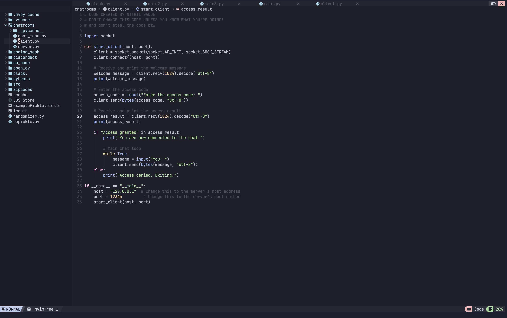

# neovim-config
my neovim config ported from NvChad

this port has a lot of features such as:
* cmp for code and the cmdline,
* debuggers (nvim-dap) for python (tested), c/c++ (not tested; fairly new addition), and rust (not tested; fairly new addition)
* vs-code type minimap
* breadcrumbs (nvim-navbuddy, nvim-navic, barbecue)
* lsp configs
  

# how to add plugins?
* go to the nvim config folder and go to the 'lua/custom' folder
* go into 'plugins.lua'
* scroll down to add any new plugins you like!

# how to configure plugins?
* go back to the 'lua' folder and go to the 'plugins' folder.
* go into the 'configs' folder
* make a new '.lua' file for your plugins and add whatever configs you like. it's already in the init.lua, so you don't need to worry about that!

enjoy!
